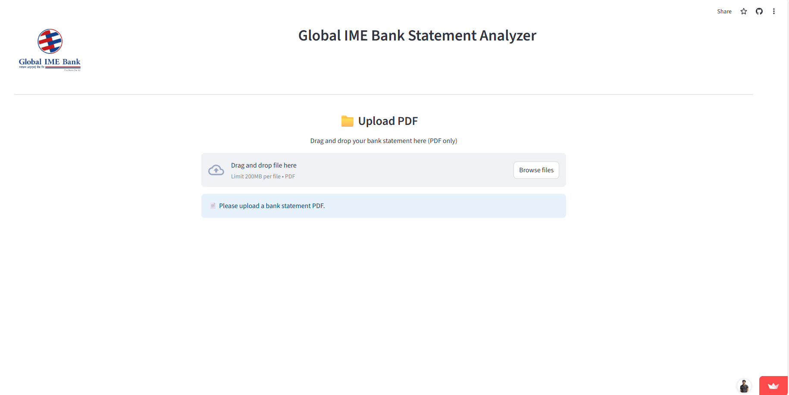
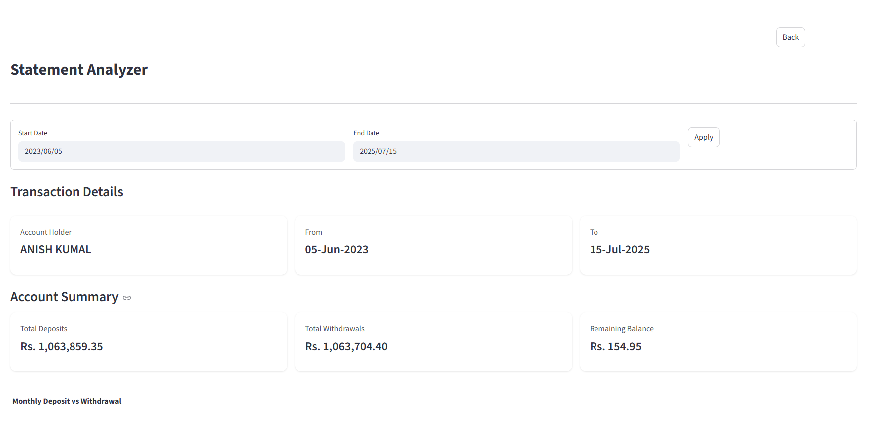
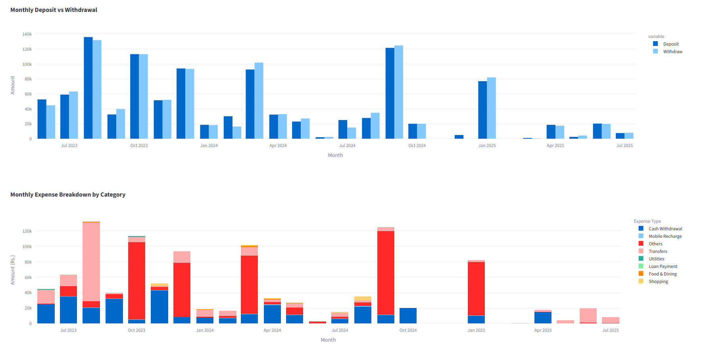
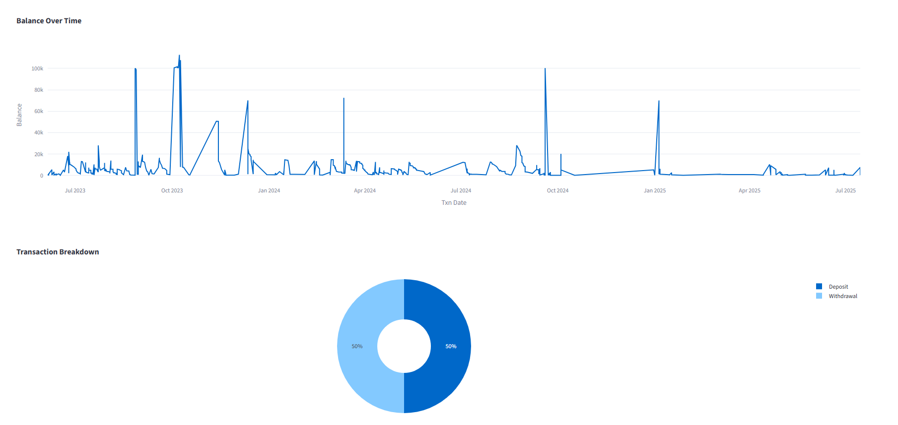

# Bank Statement Analyzer

A web-based application that analyzes Global IME Bank statements and provides visual insights of your financial transactions.

## Features

- PDF statement upload and processing
- Transaction analysis with visual charts
- Expense categorization
- Date-range filtering
- Downloadable transaction reports

## Tech Stack

- Python
- Streamlit
- Pandas
- Plotly Express
- PIL (Python Imaging Library)

## How to Use

1. Upload your Global IME Bank statement (PDF format)
2. View automatically generated:
   - Total deposits and withdrawals
   - Monthly transaction trends
   - Category-wise expense breakdown
   - Balance history
3. Filter transactions by date range
4. Download filtered transactions as CSV

## Setup

```bash
# Install required packages
uv sync

# Run the application
streamlit run app.py
```

## Screenshots







## Note


This application currently supports only Global IME Bank statements in PDF format.
